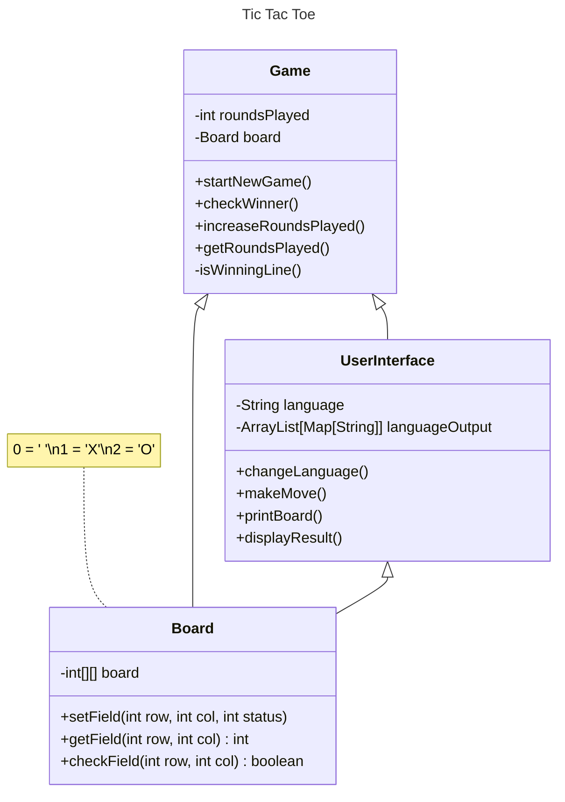

```mermaid
---
title: Tic Tac Toe
---
classDiagram
    Game <|-- Board
    Game <|-- UserInterface
    UserInterface <|-- Board

    note for Board "0 = ' '\n1 = 'X'\n2 = 'O'"
  
    class Board{
        -int[][] board
        +setField(int row, int col, int status)
        +getField(int row, int col) int
        +checkField(int row, int col) boolean
    }
    class Game{
        -int roundsPlayed
        -Board board
        +startNewGame()
        +checkWinner()
        +increaseRoundsPlayed()
        +getRoundsPlayed()
        -isWinningLine()
    }
    class UserInterface{
        -String language
        -ArrayList[Map[String]] languageOutput
        +changeLanguage()
        +makeMove()
        +printBoard()
        +displayResult()
    }
```