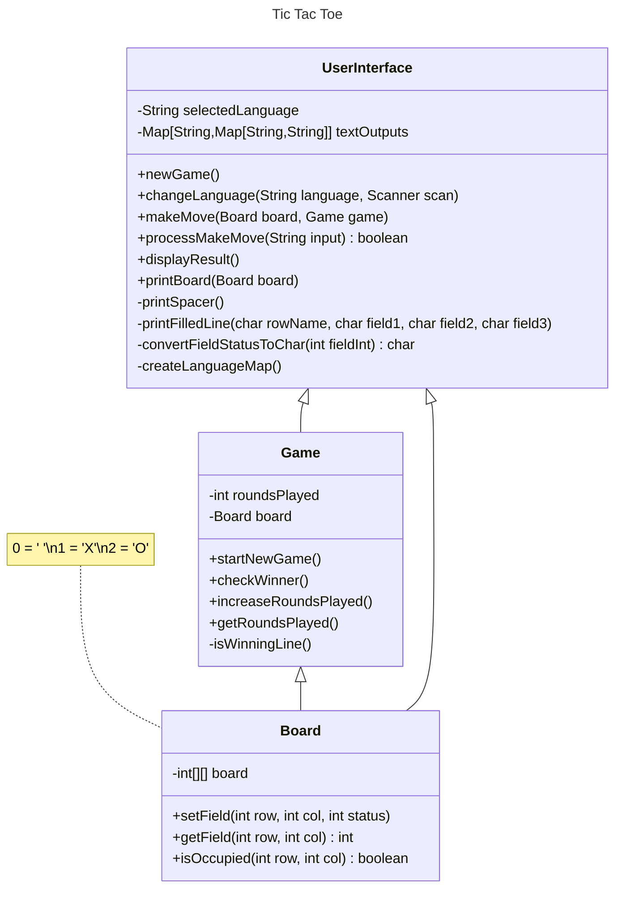

```mermaid
---
title: Tic Tac Toe
---
classDiagram
    Game <|-- Board
    UserInterface <|-- Game
    UserInterface <|-- Board

    note for Board "0 = ' '\n1 = 'X'\n2 = 'O'"
  
    class Board{
        -int[][] board
        +setField(int row, int col, int status)
        +getField(int row, int col) int
        +isOccupied(int row, int col) boolean
    }
    class Game{
        -int roundsPlayed
        -Board board
        +startNewGame()
        +checkWinner()
        +increaseRoundsPlayed()
        +getRoundsPlayed()
        -isWinningLine()
    }
    class UserInterface{
        -String selectedLanguage
        -Map[String,Map[String,String]] textOutputs
        +newGame()
        +changeLanguage(String language, Scanner scan)
        +makeMove(Board board, Game game)
        +processMakeMove(String input) boolean
        +displayResult()
        +printBoard(Board board)
        -printSpacer()
        -printFilledLine(char rowName, char field1, char field2, char field3)
        -convertFieldStatusToChar(int fieldInt) char
        -createLanguageMap()
    }
```