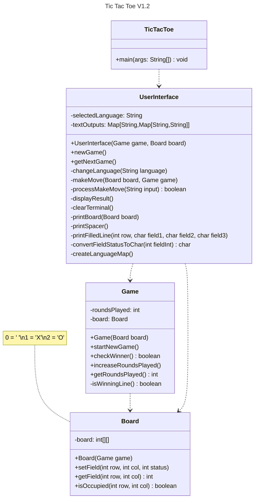

```mermaid
---
title: Tic Tac Toe V1.2
---
classDiagram
    TicTacToe ..> UserInterface
    Game ..> Board
    UserInterface ..> Game
    UserInterface ..> Board

    note for Board "0 = ' '\n1 = 'X'\n2 = 'O'"
  
    class TicTacToe{
        +main(args: String[]) void
    }
    class Board{
        -board: int[][]
        +Board(Game game)
        +setField(int row, int col, int status)
        +getField(int row, int col) int
        +isOccupied(int row, int col) boolean
    }
    class Game{
        -roundsPlayed: int
        -board: Board
        +Game(Board board)
        +startNewGame()
        +checkWinner() boolean
        +increaseRoundsPlayed()
        +getRoundsPlayed() int
        -isWinningLine() boolean
    }
    class UserInterface{
        -selectedLanguage: String
        -textOutputs: Map[String,Map[String,String]]
        +UserInterface(Game game, Board board)
        +newGame()
        +getNextGame()
        -changeLanguage(String language)
        -makeMove(Board board, Game game)
        -processMakeMove(String input) boolean
        -displayResult()
        -clearTerminal()
        -printBoard(Board board)
        -printSpacer()
        -printFilledLine(int row, char field1, char field2, char field3)
        -convertFieldStatusToChar(int fieldInt) char
        -createLanguageMap()
    }
```